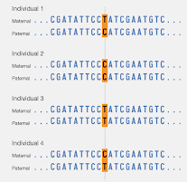

```{r setup, include=FALSE}
knitr::opts_chunk$set(echo = FALSE)
```

# 1. Genetic data are correlated

The first question we need to ask ourselves is: What does it mean to say that genetic data are correlated? Genetic data can be correlated in two ways: 

## a. Genetic data are correlated among Single nucleotide polymorphisms (SNPs), aka correlated columns in the dataset

First, a recap: SNP is a genetic variation in the DNA that occurs at a single base location. The influence of SNPs on attributes including health conditions, diseases, and treatment responses is a topic of research for scientists. In genetic data, a SNP variable has 3 values: 0 = homozygous dominant alleles, 1 = heterozygous alleles (1 major and 1 minor), 2 = homozygous minor alleles

```{r, echo=FALSE, out.width = '80%'}

```

The closer SNPs are in terms of distance, the more correlated they are with one another. This concept is called Linkage Disequilibrium (LD). LD is represented in the heatmap below, which shows the squared correlation between SNP pairs in European Americans from the HapMap dataset. Since the orange shades show the highest correlation, we see that these shades lie up along the diagonal line, representing the location of pairs of SNPs that neighbor to one another. 

```{r, echo=FALSE, out.width = '110%'}

```

### Where does LD come from? 

LD is the result of recombination, which is an exchange in genetic material to form a new pair of chromosomes for the offspring. Specifically, the offspring inherits the genetic materials from both parents, but not in the exact order as the parents' chromosomes. Either or both of the chromosomes from each parent’s chromosome pair will "recombine" through cross-over, as observed in this diagram. 

```{r, echo=FALSE, out.width = '100%'}

```

Since linkage is the probability that two segments of DNA are inherited together, SNPs that are closer in terms of distance on the chromosome are more likely to be inherited together. As the SNPs are not independently distributed and uniformly distanced on the chromosome, there’s a disequilibrium. 


```{r, echo=FALSE, out.width = '100%'}

```

### The merit of LD

One advantage is that if we have limited genetic data which do not contain the causal SNPs for the disease trait of interest, we can obtain significant results for SNPs neighboring those causal SNPs and narrow down the “SNP causal zone”. This allows subsequent research to focus more on collecting data in this area to determine the causal SNP. 

```{r, echo=FALSE, out.width = '100%'}

```

### ...But the problems are...

#### Problem 1: Difficult to figure out the causal SNPs

If a lot of the SNPs are significant, it will be hard to determine the exact SNP(s) that cause the disease to zoom in on them. 

```{r, echo=FALSE, out.width = '100%'}

```

[@image_problem_1]

#### Problem 2: Hard to determine the p-value threshold in Multiple Testing

> But first, a review: 

Multiple Testing is the process of carrying out more than one hypothesis test simultaneously. The problem associated with Multiple Testing is the change in the p-value threshold and hence an increase in the number of Type 1 errors (T1E) made. Specifically, if we conduct a single hypothesis test, the probability of making a T1E is equal to our significance level $\alpha$, which is typically set at 0.05. However, when we do multiple tests, we have more chances to make T1E, and the probability of making at least a T1E increases. For example, if we conduct 20 tests, the probability that we make at least one T1E is 

$$1 - (1 - 0.05)^{20}  \approx  0.6415$$

where $\alpha = 0.05$, the number of tests $= 20$, $1 - 0.05$ = the probably of making no T1E in a test. The result $0.6415$ is much greater than what we want $0.05$. 

### Methods to address the problems

There are two methods used to correct the p-value threshold for Multiple Testing situations: Bonferroni Correction and the Simulation-based Approach. Bonferroni Correction is a very popular approach in which we obtain our new p-value threshold by dividing our desired alpha, or the desired probability of making a T1E, typically 0.05 by the number of tests we're conducting. For the Simulation-based Approach, we simulate a null trait, which is a trait that's not associated with any of the SNPs, using GWAS and record the smallest p- values. Repeat this around 500-1000 times, and our new p-value threshold is the value at the lowest 5th percentile.

However, since Bonferroni Correction operates under the assumption that all of the SNPs are independent, the p-value threshold determined using this method tends to be very low. Therefore, the Simulation-based Approach is a more reliable method to determine the p-value threshold in the case of LD. 


## b. Genetic data are correlated among individuals, aka correlated columns in the dataset

### Relatedness Concepts

There are two different types of relatedness among the people in the dataset. They are: 

- Family relatedness: known relationships that are established based on a (usually recent) common ancestor (e.g. siblings, parents, children, cousins)

- Cryptic relatedness: unknown family relationships, often between more distant relatives who have (a) common ancestor(s)

### The problem

When we use standard techniques, e.g. linear regression, these two types of relatedness confound the analysis, which leads to the underestimation of standard errors. This makes the test statistic bigger (inflated) and, as a result, makes the p-value smaller than it actually is (inflated). When the p-value is inflated, the chance of making T1E increases. 

$$\frac{\text{Estimate}}{\text{Correct SE}} < \frac{\text{Estimate}}{\text{Too small/Underestimated SE}}$$

Or better yet, with a visualization: 

#### Small test statistic → large p-value

```{r, echo=FALSE, out.width = '100%'}

```

#### Large test statistic → small p-value

```{r, echo=FALSE, out.width = '100%'}

```

### Methods to address the problem

In order to address this problem, we have to consider methods that can infer genetic ancestry in order to stratify the relatedness in the population. 

> **PCA** has been used for a long time to infer population structure in genetic data for a long time. 

#### Pros: 

- PCA will correct markers with large differences in allele frequency across ancestral populations

- Using ancestry-informative markers (AIMs), PCA may predict genetic ancestry and correct for stratification in the absence of genome-wide data. This works because large differences in allele frequency between subpopulations that are genotyped to infer genetic ancestry in new samples have been linked to AIMs. 

#### Cons:

- PCA does not explicitly model family structure or cryptic relatedness, which could inflate test statistics.

- The population structure is not always reflected by the top primary components. Instead, they may reflect the presence of assay artifacts, long-range linkage disequilibrium, or familial resemblance. These effects can be eliminated by removing related samples, areas of long-range linkage disequilibrium, and low-quality data.

> Another alternative is to use family-based association test.

#### Pros:

Since transmitted and untransmitted alleles share the same genetic ancestry, family-based association tests concentrating on within-family information are immune to stratification. 

#### Cons:

However, fully powered statistics for family-based studies must take into account between-family information. This can be addressed by converting between-family information into a rank statistic (rank of association) prior to combining within and between family information, which ensures that both sources of information are resistant to stratification.

One of the methods that incorporate family-based association tests is Mixed Models, which can model population structure, family structure, and cryptic relatedness. A mixed model is a model that combines both fixed effects and random effects. While fixed effects are variables that are constant across individuals, random effects are variables that have different levels across the population. 

Let’s take a look at an example between GPA and absences. If we just look at the general trend between absence and GPA, we can see that there’s a linear downward trend. However, when we look further into the characteristics of the students, we can see that they are either from high or low-income backgrounds, which confounds the association between GPA and absence. Therefore, in this case, absence is the fixed effect, and income background is the mixed effect. 

```{r, echo=FALSE, out.width = '100%'}

```

```{r, echo=FALSE, out.width = '120%'}
knitr::include_graphics("gpa_group.png")
```


Similarly, in genetic data, family structure and cryptic relatedness are random effects. Population structure is arguably the fixed effect, specifically in the paper New approaches to population stratification in genome-wide association studies by Price et al [@price2010new], since modeling it as a random effect can result in spurious associations. 


```{r, echo=FALSE, out.width = '120%'}

```

[@mlblevins_2015]


Add some code here
