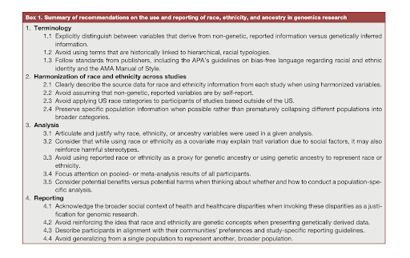

```{r setup, include=FALSE}
knitr::opts_chunk$set(echo = FALSE)
```

# The problem

In GWAS, race, ethnicity, and ancestry terminologies are used interchangeably to refer to biological genetic ancestry and social structures that are not the same, which may create stigma towards certain racial groups. Therefore, it is crucial to establish guidelines on the use of race, ethnicity, and ancestry terminology as well as analysis techniques in order to ensure fairness in all of the steps of a GWAS study, including concept definition, data sampling, data analysis, and reporting. 

# The guidelines

The researchers at NHLBI TOPMed establish guidelines that are broken down into 4 categories: 

- Terminology, related to communicating manners using racial terminologies.

- Harmonization of race and ethnicity across studies, related to data collecting, sampling, and combining/harmonizing

- Analysis, related to usage of analysis methods that avoid creating biases

- Reporting, related to reporting manners that indicates a larger social context to avoid stigmatizing racial groups)

```{r, echo=FALSE, out.width = '120%'}

```
[@guideline]

# Reflection

Data analysis are carried out by humans, who harbor various biases. Since it's an evolutionary trait, it's not to be blamed for. However, it's something that we have to recognize in order to minimize. I've watched some documentaries, including *Coded Bias*, on how biased data can perpetuate biases associated with marginalized groups of people and potentially marginalize them even further. 

It's very enlightening to read these guidelines as they have broken down biases in GWAS into four clear buckets: terminology, data sampling, data analysis, and data reporting. I find terminology and data reporting the most fascinating. As a data scientist, I pay closer attention to the methods I employ in data sampling and analysis. However, I find myself being less critical when defining the variables and reporting the results. Also, a potential danger is, in order to make the story compelling, I tend to relate the insights to real-life observations, which may harbor my own biases. Therefore, these guidelines encourage me to reflect on different stages of working with data, enabling me to recognize my biases and paint as accurate a picture as possible to the subject at hand.     


