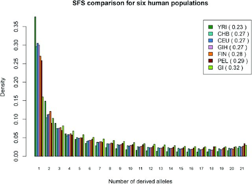
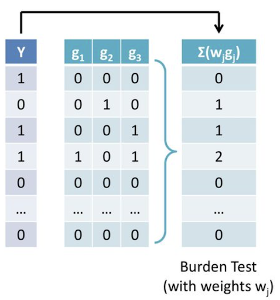

```{r setup, include=FALSE}
knitr::opts_chunk$set(echo = FALSE)
```

# 2. Genetic data are sparse

## The problem

Genetic data contain a lot of zeroes! This is due to the fact that there are many rare genetic variants. 
 

```{r, echo=FALSE, out.width = '120%'}

```

In this graph [@rare_variant], we can see that the density of alleles differs across different populations. Specifically, we have to sample data from a lot of populations in order to increase the chance of obtaining the genetic variants of interest. This process can be time-consuming and expensive, and the analysis can be computationally-extensive with a huge amount of data.
Since a lot of the currently available methods do not perform well on rare variants, this poses challenges to potential analysis, resulting in lower power or more T1Es in certain settings. 

## Methods to address the problems

One of the proposed solutions is to combine information across genes and analyze that combined information together with the trait of interest. 

```{r, echo=FALSE, out.width = '120%'}

```

[@burden_test]
